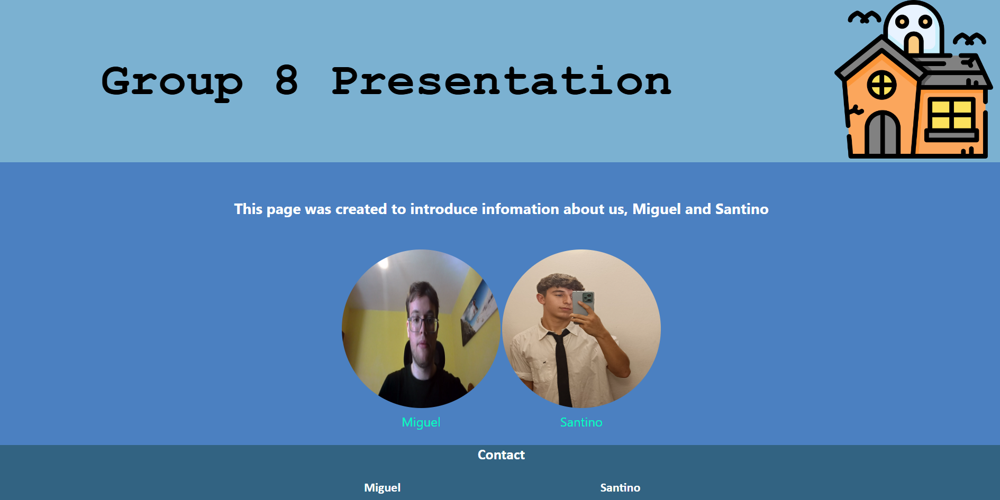
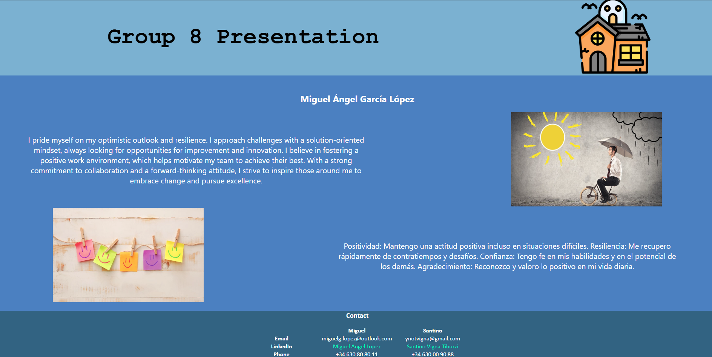
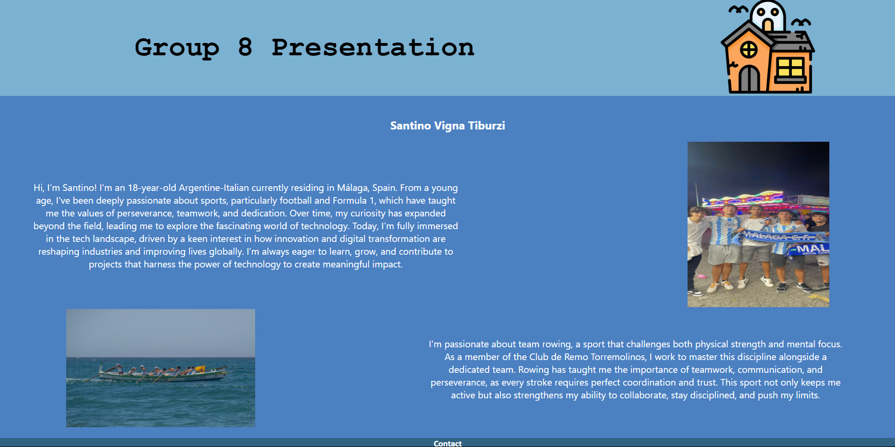

# Landing-Page
*Inside this project you can find a team page with information about us*

## Languages ​​used to develop the project

---

### Purpose
The purpose of this project was to create a page working in PairProgramming Format
---
### Landing-Page ScreenShots

#### Principal Page

#### Miguel´s Page

#### Santino´s Page Page
